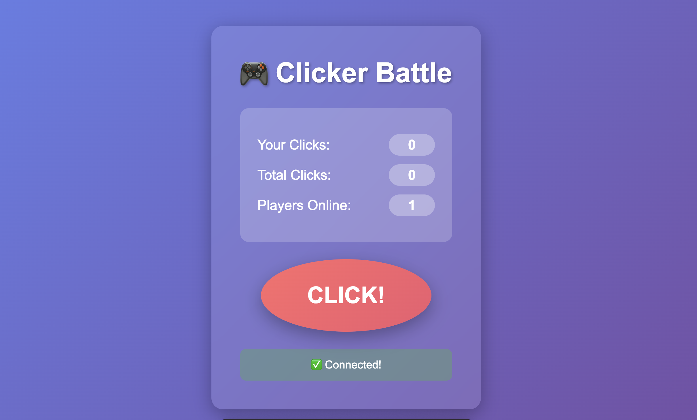
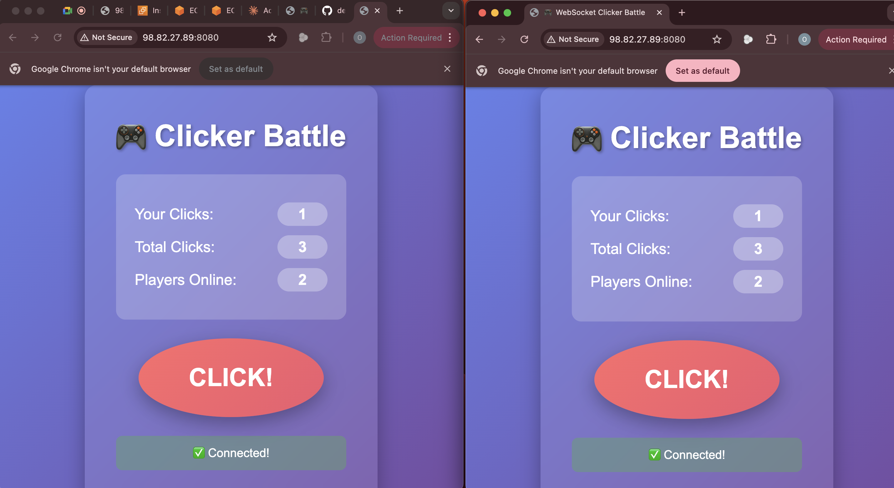
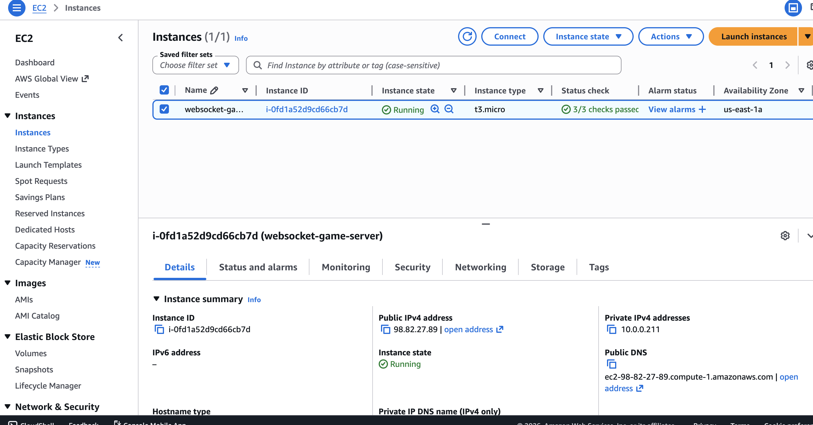
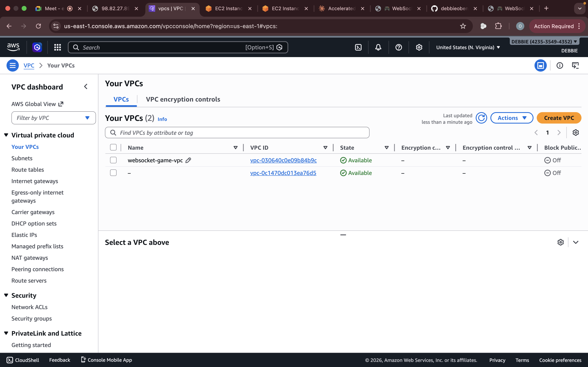

## 📸 Screenshots

### Game Homepage


### Multiplayer Demo


### EC2 Instance Running


### VPC Configuration

```

### **Step 3: Commit Changes**

1. Scroll down
2. Commit message: `Add screenshots section to README`
3. Click **"Commit changes"**

---

## 🎯 RECOMMENDED STRUCTURE

Your final repo should look like:
```
websocket-game-cicd/
├── README.md
├── server.js
├── package.json
├── public/
│   └── index.html
└── screenshots/
    ├── README.md
    ├── game-homepage.png
    ├── game-multiplayer-demo.png
    ├── ec2-instance-running.png
    ├── vpc-configuration.png
    └── security-groups.png


# 🎮 WebSocket Multiplayer Clicker Game

Real-time multiplayer game deployed on AWS.

## 🚀 Live Demo
http://98.82.27.89:8080

## ✨ Features
- Real-time WebSocket multiplayer
- Live player tracking and leaderboard
- Responsive design

## 🛠 Tech Stack
- Node.js + Express + WebSocket
- AWS VPC + EC2 (Ubuntu 22.04)
- Security Groups

## 🎯 Skills Demonstrated
- WebSocket protocol implementation
- AWS VPC configuration
- EC2 deployment and management
- Real-time bidirectional communication
- Security group configuration
- Linux server administration

---
AWS DevOps Project
EOF 

cat > .gitignore << 'EOF'
node_modules/
*.log
.env
.DS_Store
*.pem
